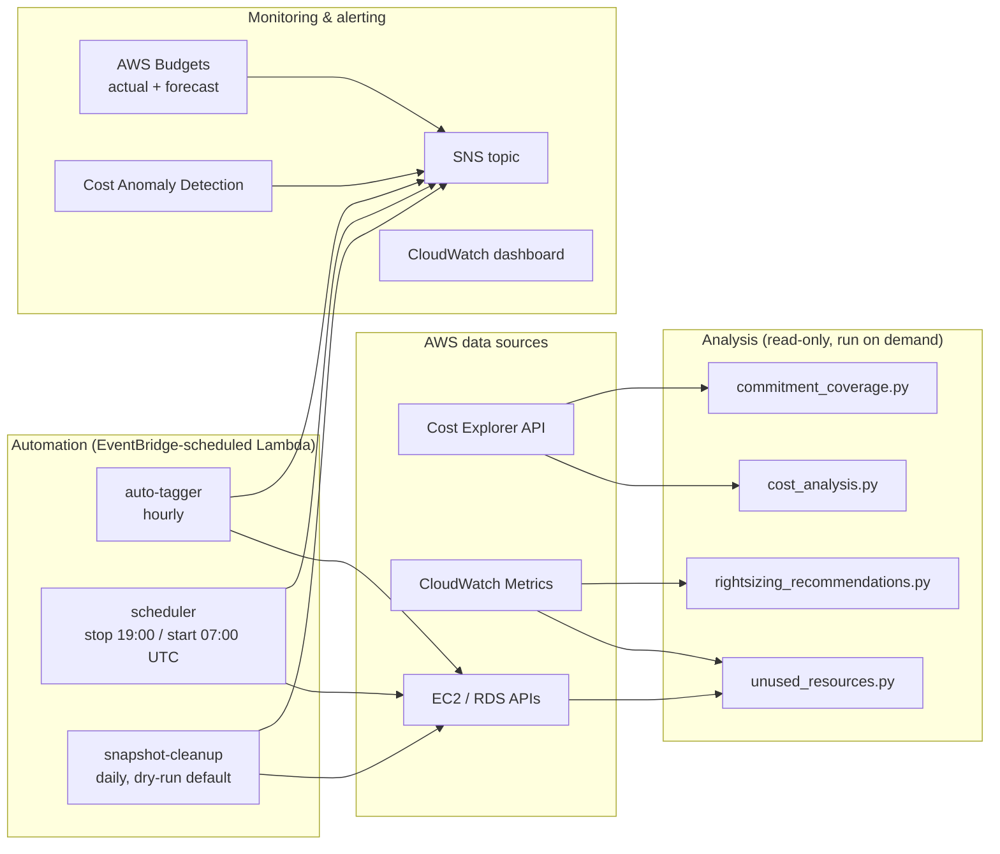

# AWS FinOps Cost Optimizer

[](https://github.com/mlakhoua-rgb/aws-finops-cost-optimizer/actions/workflows/ci.yml)
[](https://www.terraform.io/)
[](https://www.python.org/)
[](LICENSE)

A practical AWS FinOps toolkit covering the three pillars of cost optimization:

1. **Visibility** — where the money goes (Cost Explorer reports, CloudWatch dashboard, anomaly detection)
2. **Usage optimization** — stop paying for waste (idle/unattached resource detection with dollar estimates, scheduling, snapshot lifecycle)
3. **Rate optimization** — pay less for what you keep (Savings Plans / Reserved Instance utilization and coverage analysis)

Analysis is read-only Python; remediation is automated through Lambda with deliberately conservative defaults (dry-run first, opt-in tags, human review for anything destructive). Everything deploys with Terraform.

---

## Architecture



**Design principles:**

- **Findings are recommendations, not actions.** Analysis scripts never modify anything; each finding carries an estimated monthly saving (where honestly estimable) so remediation can be prioritized by impact.
- **Destructive automation is opt-in and reversible-first.** Snapshot cleanup ships in dry-run mode; the scheduler only touches instances explicitly tagged `AutoScheduler=enabled`; the auto-tagger fills missing tags but never overwrites existing values; snapshots tagged `Retain` are never deleted.
- **Least privilege.** The Lambda role grants exactly the actions the three functions perform — no wildcard service access.

---

## Repository layout

```
├── scripts/                      # Read-only analysis (run locally or in CI)
│   ├── cost_analysis.py          # Cost Explorer reports by service/region/type
│   ├── unused_resources.py       # Waste detection with $ estimates
│   ├── rightsizing_recommendations.py  # EC2 CPU+memory utilization analysis
│   └── commitment_coverage.py    # Savings Plans / RI utilization & coverage
├── lambda/                       # Scheduled automation
│   ├── auto_tagger/              # Enforce cost-allocation tags (hourly)
│   ├── scheduler/                # Stop/start EC2 outside business hours
│   └── snapshot_cleanup/         # EBS snapshot retention (dry-run default)
├── terraform/                    # Full IaC deployment (root + lambda module)
├── dashboards/                   # CloudWatch cost overview dashboard
├── tests/                        # Unit tests for scripts and Lambdas
└── docs/                         # Architecture, deployment, troubleshooting
```

---

## Quick start — analysis only (no deployment needed)

```bash
git clone https://github.com/mlakhoua-rgb/aws-finops-cost-optimizer.git
cd aws-finops-cost-optimizer
pip install -r scripts/requirements.txt

# Where does the money go? (last 30 days, by service)
python scripts/cost_analysis.py --days 30 --group-by SERVICE --output report.csv

# What is being wasted? (idle EC2/RDS, unattached EBS, unused EIPs, old snapshots)
python scripts/unused_resources.py --region eu-west-1 --output unused.json

# What is over-provisioned? (CPU always, memory when the CloudWatch Agent reports it)
python scripts/rightsizing_recommendations.py --region eu-west-1 --output recs.json

# Are commitments working? (Savings Plans / RI utilization and coverage)
python scripts/commitment_coverage.py --days 30 --output commitments.json
```

Requires AWS credentials with read access (`ce:Get*`, `ec2:Describe*`, `rds:Describe*`, `cloudwatch:GetMetricStatistics`, `sts:GetCallerIdentity`). Cost Explorer must be enabled once per account (24h backfill delay on first activation).

### Example: unused_resources.py output

```json
{
  "Summary": {
    "TotalFindings": 14,
    "FindingsByType": {"UnattachedEBSVolumes": 6, "UnusedElasticIPs": 3, "...": "..."},
    "EstimatedMonthlySavingsUSD": 187.40,
    "UnquantifiedFindings": 2,
    "PricingAssumptions": "us-east-1 on-demand list prices; snapshots costed at full volume size (upper bound). ..."
  },
  "UnattachedEBSVolumes": [
    {
      "VolumeId": "vol-0abc...",
      "VolumeType": "gp2",
      "SizeGiB": 500,
      "Finding": "Unattached EBS Volume",
      "EstimatedMonthlySavingsUSD": 50.0,
      "Recommendation": "Snapshot then delete the volume, or reattach it"
    }
  ]
}
```

Savings estimates are intentionally conservative and clearly labeled: stable unit prices (EBS GB-month, Elastic IP hours, snapshot storage) are quantified; compute savings that depend on instance pricing are flagged but left for validation with the resource owner rather than guessed.

---

## Deployment (automation + guardrails)

```bash
cd terraform
cp terraform.tfvars.example terraform.tfvars   # edit: owner_email, alert_email, budget
terraform init
terraform plan
terraform apply
```

This deploys:

| Component | Default behavior | Safety |
|---|---|---|
| Auto-tagger Lambda | Hourly; adds missing `Environment`/`Owner`/`CostCenter` tags | Never overwrites existing tag values |
| EC2 scheduler Lambda | Stop 19:00 / start 07:00 UTC, weekdays | Only instances tagged `AutoScheduler=enabled` |
| Snapshot cleanup Lambda | Daily; snapshots older than 30 days | **Dry-run by default**; `Retain` tag always wins |
| AWS Budget | Alerts at 80%/100% actual + 100% forecasted | Email via SNS |
| Cost Anomaly Detection | Per-service ML monitor, daily digest | Alerts only above `anomaly_threshold_usd` |
| S3 report bucket | Encrypted, versioned, public access blocked | Reports auto-expire (the cost tool shouldn't hoard storage) |

Import the CloudWatch dashboard (billing metrics live in us-east-1; the path is relative to the `terraform/` directory the deployment block above ran in):

```bash
aws cloudwatch put-dashboard --dashboard-name FinOps-Overview \
  --dashboard-body file://../dashboards/cost_overview_dashboard.json --region us-east-1
```

If you deploy to a region other than us-east-1, edit the two Lambda widgets' `region` in the dashboard JSON first — Lambda metrics live in the deployment region, unlike billing metrics.

Full walkthrough: [docs/DEPLOYMENT.md](docs/DEPLOYMENT.md) · Common issues: [docs/TROUBLESHOOTING.md](docs/TROUBLESHOOTING.md)

---

## What it costs to run

| Service | Typical usage | Estimated cost |
|---|---|---|
| Cost Explorer API | a few hundred requests/month | ~$2–3 ($0.01/request) |
| Lambda | ~800 invocations/month, seconds each | ~$0 (free tier) |
| CloudWatch Logs + dashboard | 30-day retention, 1 dashboard | ~$0–3 (first 3 dashboards free) |
| SNS, EventBridge, Budgets | first 2 budgets free | ~$0 |

A single unattached 100 GB gp3 volume ($8/month) or one forgotten `m5.xlarge` (~$140/month on-demand) pays for the toolkit many times over — but measure your own savings with the reports rather than trusting anyone's ROI claim, including this one.

---

## Testing & code quality

CI runs on every push and pull request ([ci.yml](.github/workflows/ci.yml)):

- **flake8** lint over `scripts/`, `lambda/`, and `tests/`
- **mypy** type checking over `scripts/`
- **pytest** — 70 unit tests covering the analysis scripts and all three Lambda handlers (AWS calls mocked; no account needed)
- **bandit** SAST scan (medium+ severity fails the build)
- **terraform validate** and **terraform fmt -check** over the full configuration

```bash
pip install -r requirements-dev.txt
pytest tests/ -v --cov=scripts --cov=lambda
```

---

## Documentation

- [ARCHITECTURE.md](docs/ARCHITECTURE.md) — components, data flow, design decisions
- [DEPLOYMENT.md](docs/DEPLOYMENT.md) — step-by-step Terraform deployment
- [TROUBLESHOOTING.md](docs/TROUBLESHOOTING.md) — common errors and fixes
- [CONTRIBUTING.md](CONTRIBUTING.md) — how to contribute

---

## Development approach

This toolkit is developed AI-assisted (Claude and other coding agents) with human review of every change — the same way I use AI in day-to-day platform work. The judgment calls are the human part: what to automate versus only report, which defaults are safe enough to ship enabled, and where a dollar estimate is honest versus misleading. CI enforces the floor: lint, types, tests, SAST, and Terraform validation on every change.

**Disclaimer:** educational/portfolio project. Thresholds, schedules, and retention policies are examples — align them with your organization's policies before production use. No employer-specific content is included.

---

## Contact

**Author:** Mohamed Ben Lakhoua
**LinkedIn:** [linkedin.com/in/benlakhoua](https://linkedin.com/in/benlakhoua)
**Email:** Mohamed@metafive.ai
**GitHub:** [github.com/mlakhoua-rgb](https://github.com/mlakhoua-rgb)

*Last updated: July 2026*
