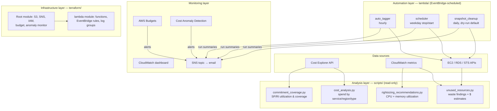

# AWS FinOps Cost Optimizer — Architecture

This document describes the system architecture, components, and data flow of the toolkit, and the reasoning behind the main design decisions.

## Guiding principles

- **Analysis and action are separated.** Scripts read and report; only the Lambda functions modify resources, each within a narrow, tag-scoped contract.
- **Conservative by default.** Anything destructive starts in dry-run or opt-in mode. A cost tool that deletes the wrong resource costs more trust than it ever saves in dollars.
- **Least privilege.** The Lambda execution role lists exactly the actions the three functions perform.
- **Cheap to run.** The toolkit's own footprint (Lambda invocations, Cost Explorer API calls, one dashboard) is a few dollars a month.

## System components

### 1. Analysis layer (`scripts/`)

Read-only Python scripts run on demand (locally, from CI, or any scheduled runner):

| Script | Question it answers | Key sources |
|---|---|---|
| `cost_analysis.py` | Where does the money go? | Cost Explorer `GetCostAndUsage` (paginated, aggregated across periods) |
| `unused_resources.py` | What are we paying for that nothing uses? | EC2/RDS describes + CloudWatch utilization |
| `rightsizing_recommendations.py` | What is over-provisioned? | CloudWatch CPU (always) + CWAgent memory (when installed) |
| `commitment_coverage.py` | Are Savings Plans / RIs earning their keep? | Cost Explorer utilization & coverage APIs |

Waste findings carry `EstimatedMonthlySavingsUSD` where a stable unit price exists (EBS GB-month, Elastic IP, snapshot storage); compute savings are deliberately left unquantified with a pointer to how to measure them, rather than guessed from a stale price table.

### 2. Automation layer (`lambda/`)

Three single-purpose Lambda functions, each triggered by EventBridge rules and each publishing an optional SNS run summary:

- **auto_tagger** (hourly): adds missing `Environment` / `Owner` / `CostCenter` tags to EC2 instances and EBS volumes so cost allocation reports stay usable. Never overwrites an existing tag value; a failure on one resource doesn't abort the run.
- **scheduler** (weekday cron pair): two rules invoke the same function with `{"action": "stop"}` in the evening and `{"action": "start"}` in the morning. Only instances tagged `AutoScheduler=enabled` participate — the tag marks membership, the event decides the action, so an instance is stopped at night and started again in the morning by the same contract.
- **snapshot_cleanup** (daily): deletes snapshots older than the retention period, except those tagged `Retain`. Ships with `DRY_RUN=true`; the operator flips it only after reviewing dry-run reports. Snapshots backing registered AMIs fail deletion with `InvalidSnapshot.InUse` and are skipped, not fatal.

### 3. Monitoring layer

- **AWS Budgets** — alerts at 80% and 100% of actual spend plus 100% of *forecasted* spend, so the warning arrives before the money is gone.
- **Cost Anomaly Detection** — per-service ML monitor with a daily digest, alerting only above a configurable dollar impact to avoid noise.
- **CloudWatch dashboard** (`dashboards/cost_overview_dashboard.json`) — estimated charges total and by service, plus invocation/error widgets for the three optimizer Lambdas (a failed optimizer run means a savings action silently didn't happen — that must be visible).
- **SNS topic** — single fan-out point for budget alerts, anomaly alerts, and automation run summaries.

### 4. Infrastructure layer (`terraform/`)

- Root module: S3 report bucket (encrypted, versioned, public-access-blocked, lifecycle-expired), SNS topic, least-privilege IAM role, budget, anomaly monitor + subscription.
- `modules/lambda`: packages each function directory with `archive_file`, deploys the functions, EventBridge rules/targets/permissions, and per-function log groups with retention.
- Lambda environment intentionally does **not** set `AWS_REGION` — it is a reserved variable the runtime provides; setting it fails deployment.
- The budget uses a fixed `time_period_start` rather than `timestamp()` to avoid a perpetual plan diff.

## Security considerations

- **IAM:** the Lambda role's policy grants only `logs:CreateLogGroup`/`CreateLogStream`/`PutLogEvents` (scoped to this project's log groups), the specific `ec2:Describe*`/`StartInstances`/`StopInstances`/`CreateTags`/`DeleteSnapshot` actions, and `sns:Publish` scoped to the alert topic.
- **Encryption:** S3 bucket uses SSE; SNS topic uses the AWS-managed KMS key.
- **No secrets in code:** everything comes from IAM roles or Terraform variables; nothing sensitive is logged.
- **Static analysis:** CI runs `bandit` (fails on medium+ severity) and `terraform validate`/`fmt` on every change.

## Deliberate limitations

Honest scope notes rather than aspirations:

- Memory-based rightsizing requires the CloudWatch Agent; without it, instances are analyzed on CPU only and clearly labeled as such.
- Idle EC2/RDS compute savings are not auto-quantified (instance pricing varies by region/OS/purchase option); findings say so instead of guessing.
- Single-account scope. Multi-account rollout would run the analysis with AWS Organizations + cross-account roles and aggregate per-account reports — a natural extension, not yet built.
- The scheduler assumes UTC cron expressions; time-zone-aware scheduling per instance would need a tag schema extension.
